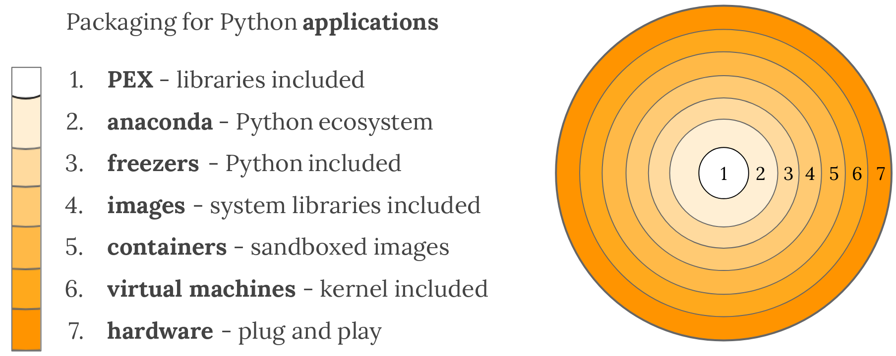

# Packaging Python Applications

PyCon Balkan, Belgrade, 2018-11-17 16:00-16:30


[Martin Czygan](mailto:martin.czygan@gmail.com) / github.com/miku / [@cvvfj](twitter.com/cvvfj)


----

# About me

* Software developer at [Leipzig University Library](https://www.ub.uni-leipzig.de/start/)
* Part-time consultant, co-author *Getting Started with Python Data Analysis* (2015)
* Maintainer of a few open source tools


----

# About me

* interest in (build) automation: code, writing, data
* anecdata: ant, ephemeral VMs, tried to ease adoption of Python at workplace

<!-- changed build system for book, worked for springer publishing, ... -->

There is some satisfaction in being able to just run *one command*. There are also some trade-offs.

----

# Packaging

* loosely defined as *approaches* and *tools* to create usable (installable, shippable) software
* There is this thing called: [The packaging gradient](http://sedimental.org/the_packaging_gradient.html)



----

# Packaging is moderately exiting

* not directly related to features
* many options

> ... plethora of packaging options ... (https://packaging.python.org/overview/)

* less formalized, project-dependent

----

# So why care about packaging?

* as individual or team
* as company

----

# Individuals or teams

* to share code
* collaborate or invite contributions

> It might seem strange to think about packaging before writing code, but this process does wonders for avoiding future headaches. (https://packaging.python.org/overview/)

----

# As a company

* Aug 9, 2000: [The Joel Test: 12 Steps to Better Code](https://www.joelonsoftware.com/2000/08/09/the-joel-test-12-steps-to-better-code/)

There are two items related to packaging:

* #2 Can you **make a build** in **one step**?
* #3 Do you make **daily builds**?

Obviously, there are many posts with title "Joel test in 2019" and such.

<!-- and one that reads 2019, still includes these two points -->

----

# On item #2

> By this I mean: <u>**how many steps**</u> does it take to make a **shipping build** from the latest source snapshot? On good teams, there's a <u>**single script**</u> you can run that does a full checkout from scratch, rebuilds every line of code, **makes the EXEs**, in all their various versions, languages, and #ifdef combinations, creates the **installation package**, and creates the final media — CDROM layout, download website, whatever.

----


# On item #2

> If the process takes any more than one step, it is <u>**prone to errors**</u>. And when you get closer to shipping, you want to have a <u>**very fast cycle**</u> of fixing the "last" bug, making the final EXEs, etc. If it takes 20 steps to compile the code, run the installation builder, etc., you’re <u>**going to go crazy**</u> and you’re going to make silly mistakes.

----

# Packaging is only a part of a larger story

* the decade of devops (2009-)
* code--build--test--**package**--**release**--configure--monitor

There slides reflect only a few small pieces of the puzzle.

----

# The Packaging Gradient

There is an nice talk called *The Packaging Gradient* by Mahmoud Hashemi at [PyBay 2017](https://www.youtube.com/watch?v=iLVNWfPWAC8) (YT:601), [BayPiggies2017](https://www.youtube.com/watch?v=Q3LyPTTb81w) (YT:82) - [blog](https://sedimental.org/the_packaging_gradient.html).

> One lesson threaded throughout Enterprise Software with Python is that deployment is **not the last step of development**. 

----

# What will we look at?

* "just do nothing"
* modules, packages, distributions, PyPI
* single file deployments (PEP 441)
* frozen software
* reusing linux package managers
* building images

----

# A single Python file (module)

* with a large standard library, it is possible to write useful things in Python and stdlib only
* deployment cannot get simpler that `scp` or `curl`

```shell
# scp script.py ...
```

Requirements:

* ssh
* python on target machine (matching version)
* script should have no dependencies

Beautiful, if possible (*simple is better than complex*).

----

# Module, package, distribution

* a **module** is as single, importable python file
* a **package** is a directory (containing an `__init__.py`)
* a **distribution** is a way to bundle zero or more packages (source and built distribution)

----

# A minimal setup.py

Writing a setup.py file can be simple.

> The smallest python project is two files. A setup.py file which describes the metadata about your project, and a file containing Python code to implement the functionality of your project.

However, there are only three required fields: **name**, **version**, and **packages**.

> The name field must be unique if you wish to publish your package on the Python Package Index (PyPI). The version field keeps track of different releases of the project. The packages field describes where you’ve put the Python source code within your project.

----

# A minimal setup.py

```shell
$ tree
.
├── hellopkg
│   ├── __init__.py
│   └── hello.py
└── setup.py
```

```python
$ cat setup.py
from setuptools import setup

setup(name='hellopkg',
      version='0.1.0',
      packages=['hellopkg'])
```

----

# Additional fields in setup.py

Usually, you project will have dependencies and it might come with command line programs:

```python
from setuptools import setup

setup(name='hellopkg',
      version='0.1.0',
      packages=['hellopkg'],
      install_requires=['requests'],
      entry_points={
          'console_scripts': [
          	'hellopkg-cli=hellopkg.hello:hello'
          ],
      })
```

----

# Creating a source distribution (sdist)

* includes source files, might adjust what gets included in a MANIFEST.in

```shell
$ python setup.py sdist
...

$ tree .
.
├── dist
│   └── hellopkg-0.1.0.tar.gz
├── hellopkg
│   ├── __init__.py
│   └── hello.py
└── setup.py
```

----

# Upload to [Test]PyPI

```
$ twine upload dist/hellopkg-0.1.0.tar.gz
```

* [https://pypi.org/project/twine/](https://pypi.org/project/twine/)

> The biggest reason to use twine is that it securely authenticates you to PyPI over HTTPS using a verified connection regardless of the underlying Python version, while whether or not python setup.py upload will work correctly and securely depends on your build system, your Python version and the underlying operating system.

----

# Use testpypi for testing

* https://packaging.python.org/guides/using-testpypi/

> TestPyPI is a separate instance of the Python Package Index (PyPI) that allows you to try out the distribution tools and process without worrying about affecting the real index. TestPyPI is hosted at test.pypi.org

----

# Minimal viable distribution

* structure your code
* add setup.py
* done

----

# Tools to create a Python Package

* cookiecutter
* e.g. https://github.com/audreyr/cookiecutter-pypackage


```
$ pip install -U cookiecutter
$ cookiecutter https://github.com/audreyr/cookiecutter-pypackage.git
```

----

# Creating a built distribution (bdist)

* wheel packaging standard, [PEP 427](https://www.python.org/dev/peps/pep-0427/)

```shell
$ python setup.py bdist_wheel
.
├── dist
│   └── hellopkg-0.1.0-py3-none-any.whl
├── hellopkg
│   ├── __init__.py
│   └── hello.py
└── setup.py

$ file dist/hellopkg-0.1.0-py3-none-any.whl
dist/hellopkg-0.1.0-py3-none-any.whl: Zip archive data
```
---

# Wheel types

* universal, pure python (2 or 3), platform (ext)

The wheel filename follows [PEP 425](https://www.python.org/dev/peps/pep-0425).

```
{distribution}-{version}(-{build tag})?- \
    {python tag}-{abi tag}-{platform tag}.whl
```

> For example, the tag <u>**py27-none-any**</u> indicates compatible with Python 2.7 with no abi requirement, on any platform. (cf. [PEP 3149](https://www.python.org/dev/peps/pep-3149/)).

```
hellopkg-0.1.0-cp36-cp36m-macosx_10_12_x86_64.whl
```

<!--

#    --with-pydebug (flag: d)
#    --with-pymalloc (flag: m)
#    --with-wide-unicode (flag: u)

>>> import sysconfig
>>> sysconfig.get_config_var('SOABI')
'cpython-36m-darwin'
-->

----

# Creating a built distribution (bdist)

```shell
$ python setup.py bdist_wheel
```

> This will build any C extensions in the project and then package those and the pure Python code into a .whl file in the dist directory.

-- https://wheel.readthedocs.io/en/stable/user_guide.html

----

# Crossplatform wheels 

> Python wheels are great. Building them across Mac, Linux, Windows, on multiple versions of Python, is not.

* https://github.com/joerick/cibuildwheel (Travis CI, Appveyor, and CircleCI)

----

# The manylinux tag

* https://github.com/pypa/manylinux, [demo](https://github.com/pypa/python-manylinux-demo)

> The goal of the manylinux project is to provide a convenient way to distribute binary Python extensions as wheels on Linux. 

From [PEP 513](https://www.python.org/dev/peps/pep-0513/):

> ... For Linux, the situation is much more delicate. In general, compiled Python extension modules built on one Linux distribution will not work on other Linux distributions, [...]
> 
> The two key causes are dependencies on shared libraries which are not present on users' systems, and dependencies on particular versions of certain core libraries like glibc.

----

# Additional setup.cfg

> If your project contains **no C extensions** and is expected to work on both **Python 2 and 3**, you will want to tell wheel to produce universal wheels by adding this to your setup.cfg file.

```shell
$ python setup.py bdist_wheel --universal
```

or

```ini
[bdist_wheel]
universal = 1
```

----

# Wheel benefits

> Wheels are unbelievably critical in that they allow **super easy caching** of pre-built packages on any given host. If you've noticed these days you can type `pip install numpy` at will and it seems to usually run in less than **two seconds rather than 5 minutes, thank wheels**. This is particularly a big deal if you work lot with CI. 

-- zzzeek on [Aug 14, 2016](https://news.ycombinator.com/item?id=12285497)

----

# Now to something completely different

----


