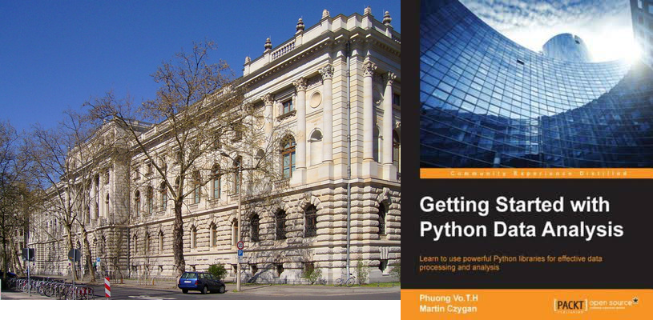

# Packaging Python Applications

PyConBalkan, Belgrade, 2018-11-17 16:00-16:30

[Martin Czygan](mailto:martin.czygan@gmail.com) / github.com/miku / [@cvvfj](twitter.com/cvvfj)

----

# About me

* Software developer at [Leipzig University Library](https://www.ub.uni-leipzig.de/start/)
* Part-time consultant, co-author *Getting Started with Python Data Analysis* (2015)

----

# About me

* interest in (build) automation: code, writing, data
* anecdata: ant, ephemeral VMs, tried to ease adoption of Python at workplace

<!-- changed build system for book, worked for springer publishing, ... -->

There is some satisfaction in being able to just run *one command*. There are also some trade-offs.

----

# Packaging

* loosely defined as approaches and tools to create usable (installable, shippable) software
* there is this thing called: *The packaging gradient* 

----

# Packaging is moderately exiting

* not directly related to features
* many options

> ... plethora of packaging options ... (https://packaging.python.org/overview/)

* less formalized, project-dependent

----

# So why care about packaging?

* to share code
* to collaborate

> It might seem strange to think about packaging before writing code, but this
> process does wonders for avoiding future headaches. (https://packaging.python.org/overview/)

----

